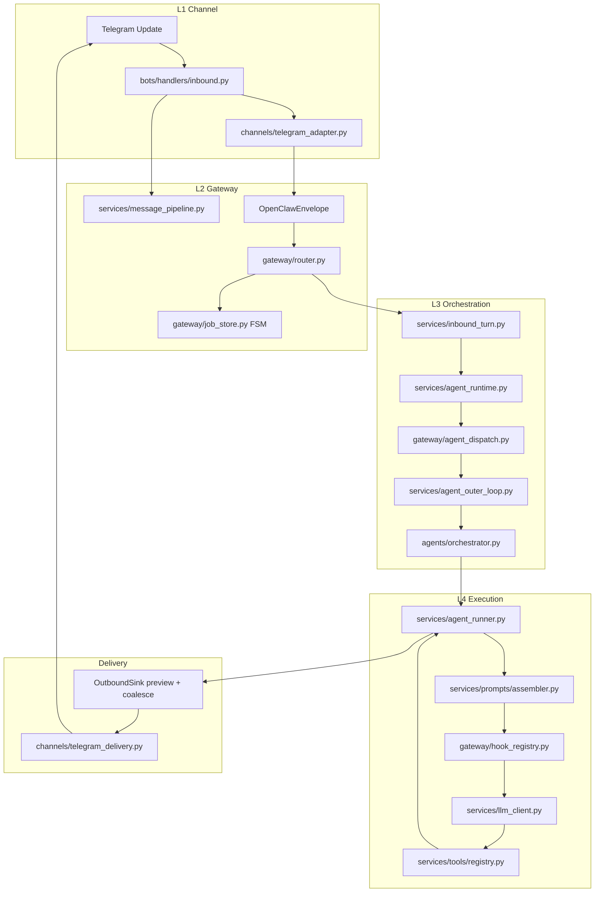

# Agent pipeline — Telegram → Gateway → LLM → Delivery

Каноническая цепочка обработки inbound-сообщений (OpenClaw/Manus-adapted, Python/aiogram).

## Flow



## File map

| Layer | Module | Responsibility |
|-------|--------|----------------|
| L1 | `bots/agent_bot.py` | Thin shell: polling, register handlers (~140 LOC) |
| L1 | `bots/handlers/commands.py` | `/start`, `/help`, `/journal`, … |
| L1 | `bots/handlers/inbound.py` | DM + group mention, debounce entry |
| L1 | `bots/handlers/callbacks.py` | Confirmation inline buttons |
| L1 | `channels/telegram_adapter.py` | `Message` → `OpenClawEnvelope` |
| L2 | `services/message_pipeline.py` | Dedupe, debounce 2s, per-chat lock |
| L2 | `gateway/envelope.py` | Envelope schema, idempotency key |
| L2 | `gateway/router.py` | Dispatch, job FSM start/complete/fail |
| L2 | `gateway/job_store.py` | PG `agent_jobs` + in-memory fallback |
| L2 | `gateway/coalesce.py` | idleMs merge before send |
| L3 | `services/inbound_turn.py` | Turn orchestration, delivery, delegation |
| L3 | `gateway/agent_dispatch.py` | **Single entry:** `dispatch_agent(envelope)` |
| L3 | `services/agent_runtime.py` | `run_inbound`, `OutboundSink` |
| L3 | `services/agent_outer_loop.py` | `MAX_AGENT_TURNS`, checkpoint |
| L4 | `services/prompts/` | OpenClaw-style layers: system_directives, styles/, orchestrator_directives, finalize_directives, tier_rules, assembler |
| L4 | `gateway/tool_policies.py` | Declarative agent deny + tier allow + high-risk validators |
| L4 | `gateway/hooks/tool_policy.py` | Deterministic before_tool tier enforcement |
| L4 | `services/tools/registry.py` | Per-agent tool name matrix |
| L4 | `services/agent_runner.py` | LLM + tool loop only |
| Out | `channels/delivery/streaming.py` | Preview `editMessageText` |
| Out | `channels/telegram_delivery.py` | Chunk, humanDelay, retry |

## Job FSM

```
queued → running → done | failed
```

- `router.dispatch()` creates job (`queued`), then `start_job()` → `running`
- `inbound_turn` completes via `router.complete_job()` or `fail_job()`

## Prompt assembly

```
tier_rules.detect_prompt_tier(user_message)
  → assembler.build_system_prompt(tier, soul, env, memory)
  → behavior.py directives + identity.py soul + memory_block.py
```

Legacy shims: `agent_prompts.py`, `prompt_builder.py` re-export from `services/prompts/`.

## Settings (delivery UX)

| Env | Default | Purpose |
|-----|---------|---------|
| `PREVIEW_STREAMING_ENABLED` | `true` | Thinking message preview edits |
| `COALESCE_IDLE_MS` | `400` | Merge short outbound blocks (0 = off) |
| `HUMAN_DELAY_MS_MIN/MAX` | 800–2500 | Pause between Telegram bubbles |

## Architecture boundary

`agent_bot` and handlers **must not** import L3 agents directly (`personal_assistant`, `orchestrator`, `specialists`). Enforced by `tests/test_arch_layer_boundaries.py`.

## Related docs

- [OPENCLAW_PARITY.md](OPENCLAW_PARITY.md) — feature matrix
- [AGENT_RUNTIME.md](AGENT_RUNTIME.md) — triggers, autonomy
- [E2E_AUTONOMY.md](E2E_AUTONOMY.md) — prod acceptance W1–W30
- [PROJECT_VERIFICATION.md](PROJECT_VERIFICATION.md) — verify commands
