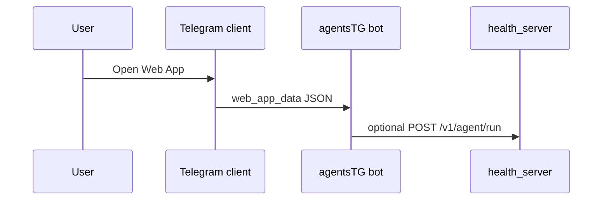

# Telegram Web Apps (optional, phase 5)

**Status:** optional — use when inline keyboards are insufficient.

## Use cases

| Flow | Why Web App |
|------|-------------|
| Long project brief | Multi-field form, validation |
| Confirm high-impact action | Rich preview + checkbox |
| Recipe / plan editor | Structured steps before submit |

## Architecture (sketch)

## Implementation notes

- Mini App hosted on static CDN or VPS `/static/`.
- Validate `initData` HMAC with bot token (Telegram docs).
- Submit via `answerWebAppQuery` or normal message with `web_app_data`.
- **Not required for MVP** — defer until solo owner requests a form-heavy flow.

## Security

- Never embed secrets in client bundle.
- Same `AGENT_RUN_API_TOKEN` pattern if server-side submit from Web App backend.

## Decision

Proceed when **≥2** flows need forms; otherwise keep inline confirm + plain text.
